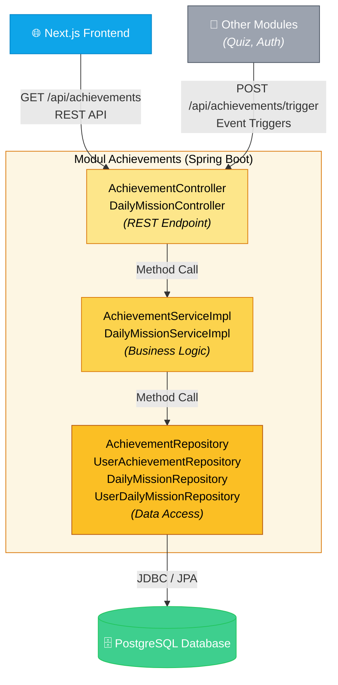
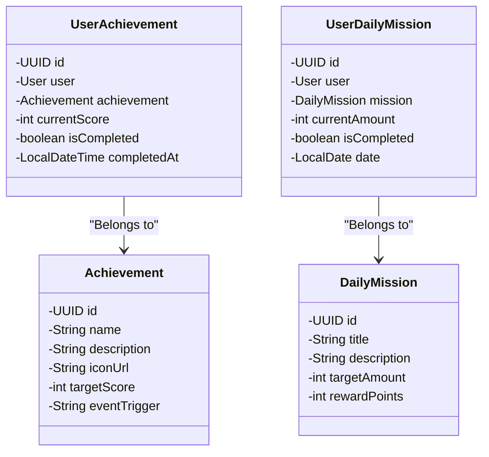
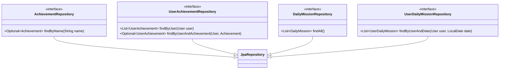
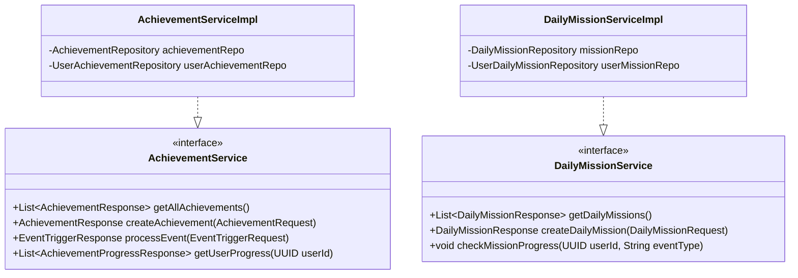
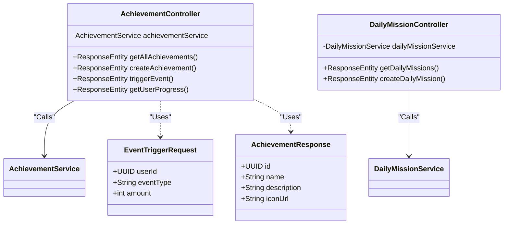

# Achievements Module

Bagian ini memaparkan dokumentasi arsitektur spesifik untuk modul **Achievements** yang dikerjakan secara individu.

## 1. Component / Container Diagram
Diagram berikut menunjukkan bagaimana modul Achievements menerima *request* dari Frontend maupun modul lain (seperti Quiz dan Auth untuk men-trigger *event*), serta memproses logika gamifikasi dan berinteraksi dengan basis data.

## 2. Code Diagrams (Class Diagrams)

Berikut adalah beberapa *Code Diagram* (Class Diagram) yang membedah arsitektur internal dari kode di modul Achievements.

### 2.1 Model & Entities Diagram
Diagram ini memetakan entitas basis data yang digunakan untuk menyimpan master data *achievement* dan *daily mission*, serta tabel *mapping* ke *user*.

### 2.2 Repository Diagram
Diagram ini menunjukkan pemanfaatan Spring Data JPA untuk abstraksi operasi basis data.

### 2.3 Service Layer Diagram
Bagian utama tempat berjalannya proses gamifikasi, pengecekan *progress*, dan validasi pembukaan suatu *achievement*.

### 2.4 Controller & DTO Diagram
Diagram untuk lapisan *presentation* (API endpoint) dan *Data Transfer Object* yang membatasi data yang dikirim dan diterima oleh API.

## 3. Penjelasan Refleksi Arsitektur Individu

Secara keseluruhan, modul **Achievements** mengadopsi _Layered Architecture_ (Controller, Service, Repository) yang sangat umum dalam Spring Boot. Pemisahan antarmuka (interface) di level Service (`AchievementService` dan `DailyMissionService`) memungkinkan pengujian (*unit testing*) dengan struktur _Mocking_ yang lebih mudah serta menjaga kelenturan seandainya implementasi dari validasi kondisi *achievement* berubah sewaktu-waktu.

Pada arsitektur saat ini (Monolith), modul-modul lain (seperti _Quiz_ dan _Auth_) dapat men-trigger *gamification events* melalui REST endpoint (`/trigger`) atau pemanggilan internal langsung jika ada _direct coupling_. Namun, seiring dengan rekomendasi _Risk Storming_, desain ini sudah cukup siap dimigrasikan menuju _Event-Driven Architecture_ (EDA). Nantinya `AchievementController` tidak lagi dipanggil melalui REST internal antar-modul, melainkan digantikan dengan **Event Subscriber** yang mendengarkan `quiz.completed` atau `user.registered` dari _Message Broker_.
