## Component Diagram

Menunjukkan komponen internal Authentication Module dan cara interaksinya.

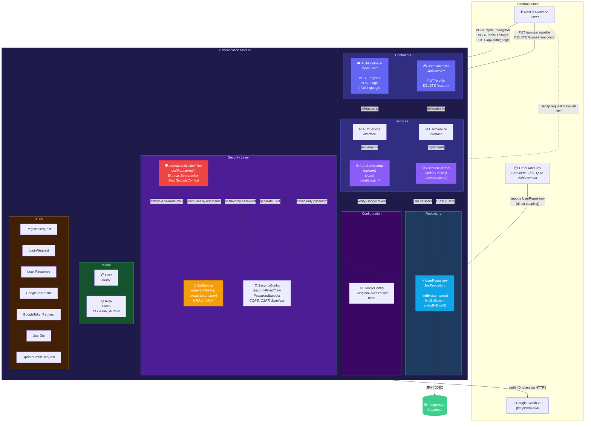

### Ringkasan Interaksi Komponen

| From | To | Interaksi | Protokol |
|---|---|---|---|
| Frontend | AuthController | `POST /api/auth/{register,login,google}` | REST/JSON |
| Frontend | UserController | `PUT /api/users/profile`, `DELETE /api/users/account` | REST/JSON (JWT required) |
| Setiap request | JwtAuthenticationFilter | Intercept sebelum controller | Servlet Filter |
| JwtAuthenticationFilter | JwtService | `extractUsername()`, `isTokenValid()` | Method call |
| JwtAuthenticationFilter | UserRepository | `findByUsername()` untuk load user | Method call |
| AuthController | AuthServiceImpl | `register()`, `login()`, `googleLogin()` | Method call |
| UserController | UserServiceImpl | `updateProfile()`, `deleteAccount()` | Method call |
| AuthServiceImpl | UserRepository | `findByUsername()`, `findByEmail()`, `existsByEmail()`, `save()` | JPA |
| AuthServiceImpl | JwtService | `generateToken(claims, username)` | Method call |
| AuthServiceImpl | GoogleIdTokenVerifier | `verify(idToken)` | HTTPS ke Google |
| AuthServiceImpl | PasswordEncoder | `encode()`, `matches()` | Method call |
| UserServiceImpl | UserRepository | `findByUsername()`, `save()`, `delete()` | JPA |
| UserServiceImpl | PasswordEncoder | `matches()`, `encode()` | Method call |
| Other Modules | UserRepository | Direct import (tight coupling) | JPA |

---

## Class Diagram - AuthService

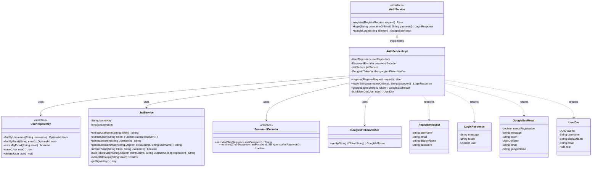

---

## Class Diagram - User Entity

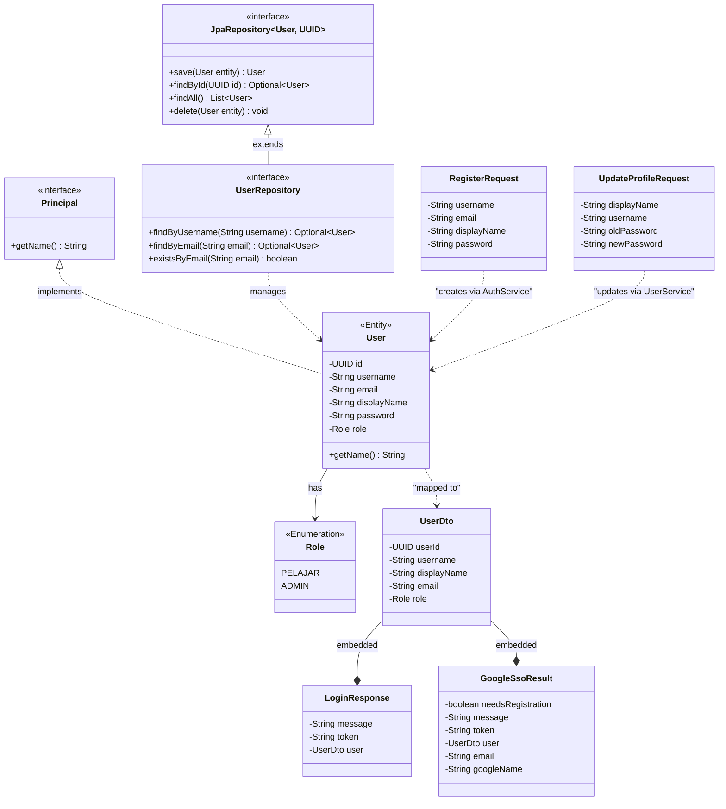

---

## Sequence Diagram - Google SSO Login Flow

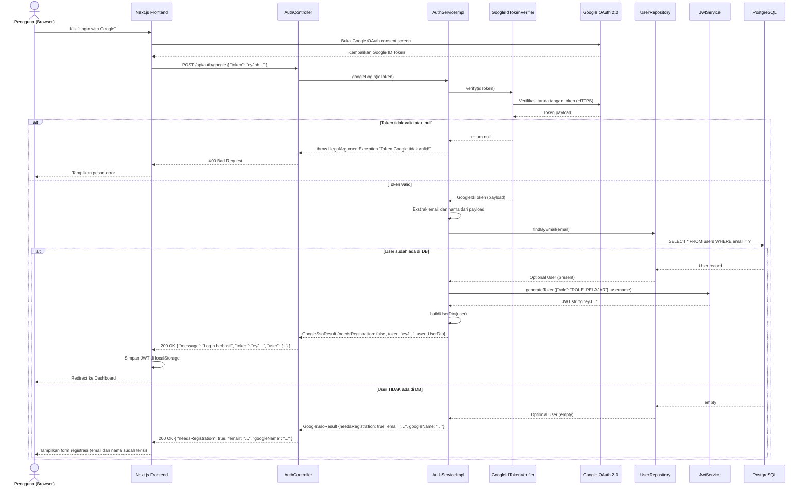

---

## Sequence Diagram - JWT Authentication Flow

### Part 1: Login dan Penerbitan Token

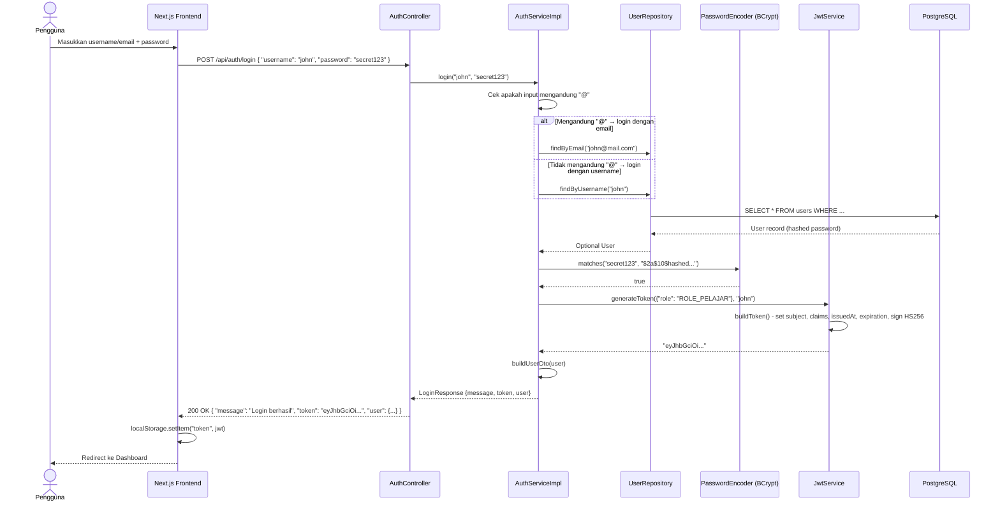

### Part 2: Mengakses Protected Endpoint

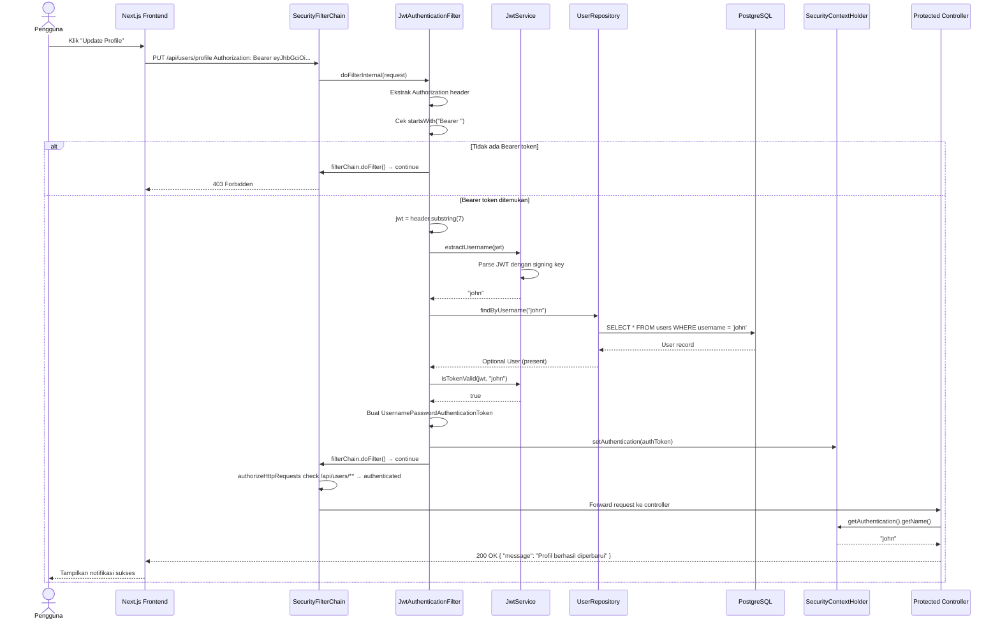

---

# Bonus - Security Layer

## Component Diagram - Security Layer Internal Structure

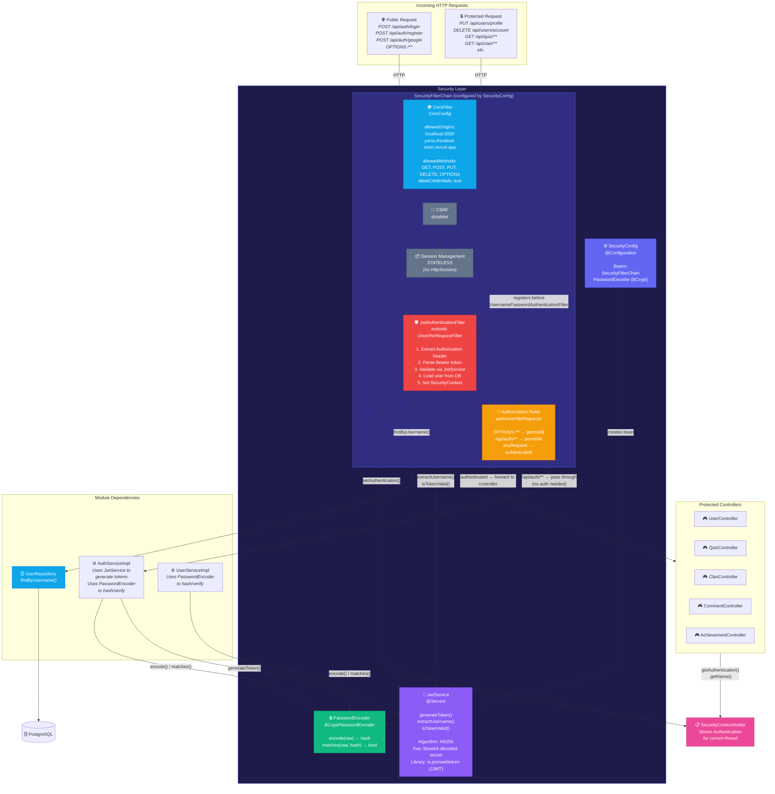

### Request Processing Pipeline (Urutan Eksekusi)

| Step | Komponen | Yang Terjadi |
|---|---|---|
| **1** | CorsFilter (CorsConfig) | Memeriksa header `Origin` terhadap allowed origins dan menambahkan CORS response headers |
| **2** | CSRF | Dinonaktifkan karena API bersifat stateless |
| **3** | Session Management | `STATELESS`, Spring tidak pernah membuat atau menggunakan `HttpSession` |
| **4** | JwtAuthenticationFilter | Mengekstrak Bearer token, memvalidasi, memuat user, dan menetapkan `SecurityContext` |
| **5** | Authorization Rules | Memeriksa apakah endpoint bersifat publik atau memerlukan autentikasi |
| **6** | Controller | Memproses request bisnis jika sudah terotorisasi |

---

## Class Diagram - JwtService

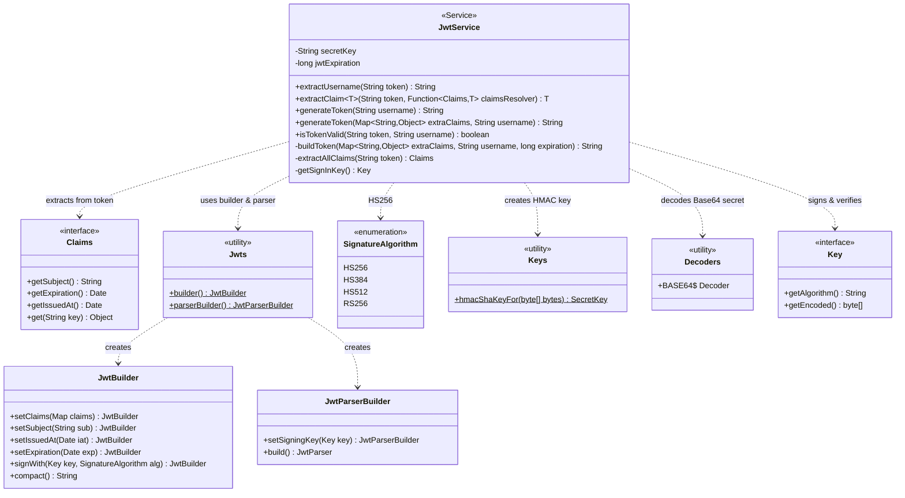

### Tanggung Jawab Method

| Method | Visibilitas | Tujuan |
|---|---|---|
| `extractUsername(token)` | public | Mengekstrak claim `sub` (subject) yaitu username |
| `extractClaim(token, resolver)` | public | Generic extractor claim menggunakan `Function<Claims, T>` |
| `generateToken(username)` | public | Membuat JWT tanpa extra claims |
| `generateToken(extraClaims, username)` | public | Membuat JWT dengan custom claims seperti `{role: ROLE_PELAJAR}` |
| `isTokenValid(token, username)` | public | Memeriksa apakah username yang diekstrak cocok dengan username yang diberikan |
| `buildToken(extraClaims, username, exp)` | private | Core builder: menetapkan claims, subject, iat, exp, dan menandatangani dengan HS256 |
| `extractAllClaims(token)` | private | Mem-parse JWT string menjadi objek `Claims` |
| `getSignInKey()` | private | Mendekode Base64 `secretKey` menjadi objek HMAC `Key` |

---

## Class Diagram - JwtAuthenticationFilter

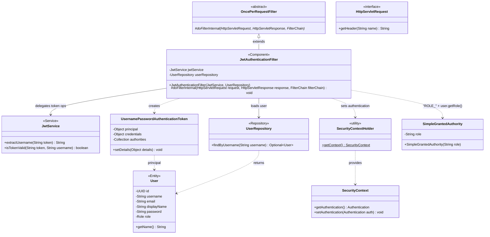

Filter execution flow:
1. Baca header `Authorization`
2. Jika tidak ada atau tidak dimulai dengan `Bearer ` → lewati
3. `jwt = header.substring(7)`
4. `username = jwtService.extractUsername(jwt)`
5. Jika username tidak null dan belum ada auth di context: load user dari repository, validasi token, set SecurityContext
6. Exception apapun akan di-catch secara diam-diam (request tetap unauthenticated)
7. Selalu panggil `filterChain.doFilter()`

---

## Sequence Diagram - Expired Token Request Flow

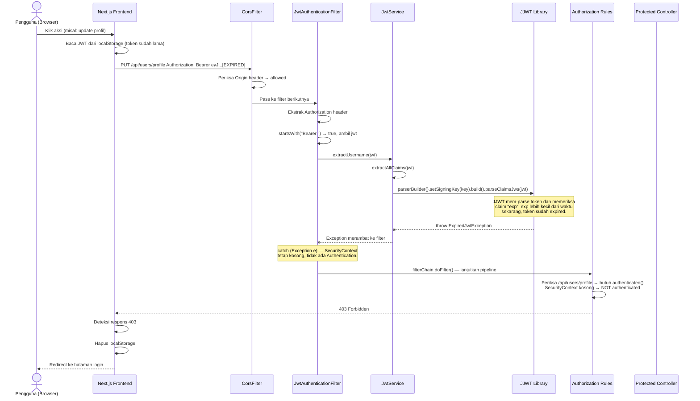

### Catatan Penting

| Step | Yang Terjadi |
|---|---|
| Parsing token | JJWT secara internal memeriksa claim `exp` saat `parseClaimsJws()` dipanggil |
| Exception catch | `catch (Exception e)` menelan `ExpiredJwtException` secara diam-diam |
| SecurityContext kosong | `setAuthentication()` tidak pernah dipanggil, request dianggap unauthenticated |
| Respons 403 | Spring Security menolak akses unauthenticated ke endpoint yang dilindungi |

Catatan: Implementasi saat ini mengembalikan 403 Forbidden untuk token yang expired. Perbaikan yang disarankan adalah menangkap `ExpiredJwtException` secara spesifik dan mengembalikan 401 Unauthorized dengan pesan yang jelas, sehingga frontend dapat memicu alur token refresh.

---

## State Diagram - JWT Token Lifecycle

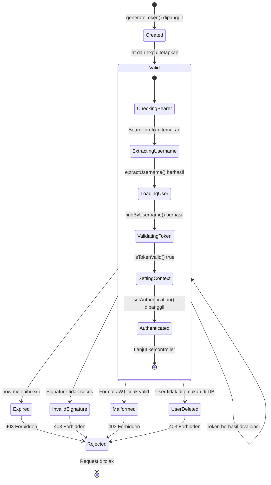

### Ringkasan Transisi State Token

| State | Trigger | Exception | HTTP Result |
|---|---|---|---|
| **Created** | `AuthServiceImpl.login()` atau `googleLogin()` memanggil `generateToken()` | Tidak ada | 200 + token di response body |
| **Valid** | `now < exp` AND signature cocok AND user ada di DB | Tidak ada | Request diproses normal |
| **Expired** | `now > exp` (JJWT memeriksa saat `parseClaimsJws`) | `ExpiredJwtException` | 403 Forbidden |
| **Invalid Signature** | Token dimanipulasi atau `jwt.secret` salah | `SignatureException` | 403 Forbidden |
| **Malformed** | String token bukan format JWT valid | `MalformedJwtException` | 403 Forbidden |
| **User Deleted** | Token valid tapi user tidak ada lagi di DB | Tidak ada | 403 Forbidden |
| **Blacklisted** | Belum diimplementasikan, membutuhkan token blacklist store | Tidak ada | Belum ada |