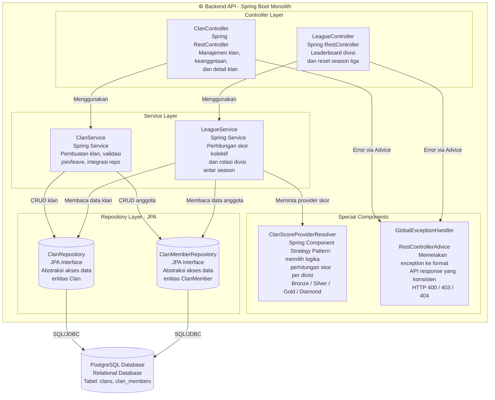
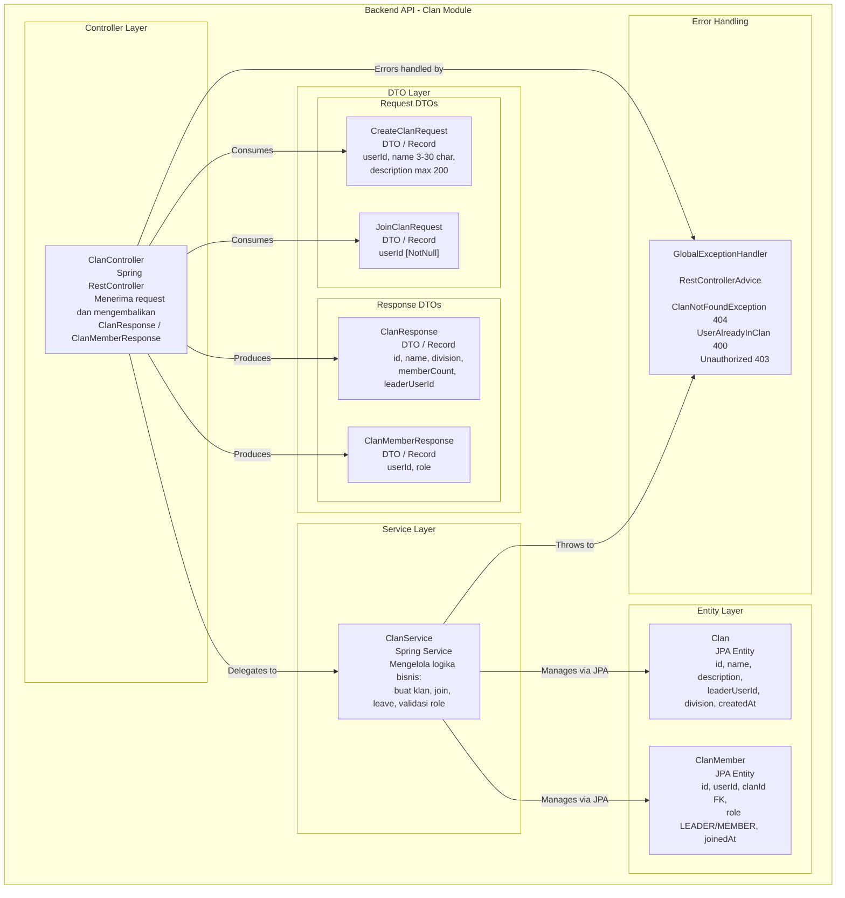
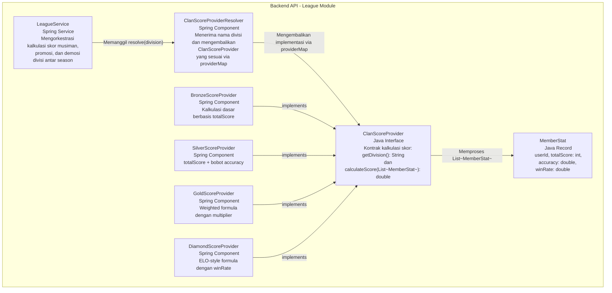
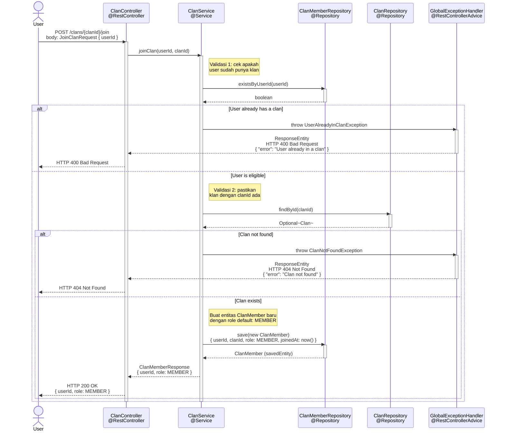
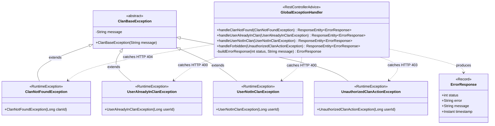

# Component diagram

### Justifikasi
Diagram komponen ini merupakan dekomposisi dari container Backend API. Modul Clan dirancang dengan prinsip Separation of Concerns, di mana ClanService berfokus pada manajemen entitas klan, sementara LeagueService menangani fitur kompetitif. Implementasi ClanScoreProviderResolver menunjukkan penggunaan Strategy Pattern untuk menghitung skor secara dinamis. Seluruh komunikasi data keluar masuk modul difasilitasi oleh folder dto untuk menjaga enkapsulasi entitas database, dan manajemen error dipusatkan pada GlobalExceptionHandler.

# Code Diagram

## Class Diagram - DTO Pattern & Core Domain

### Justifikasi
Diagram ini menunjukkan penerapan Data Transfer Object (DTO) untuk menjaga enkapsulasi entitas database (Clan dan ClanMember). Dengan menggunakan DTO, modul memastikan bahwa perubahan pada struktur database tidak akan merusak kontrak API dengan frontend. Relasi komposisi antara Clan dan ClanMember memastikan integritas data dalam hubungan satu-ke-banyak.

## Class Diagram - League Strategy Pattern

### Justifikasi
Implementasi Strategy Pattern digunakan untuk menangani kalkulasi skor yang berbeda di tiap divisi (Bronze hingga Diamond). Dengan menggunakan ClanScoreProviderResolver, sistem dapat menentukan algoritma perhitungan secara dinamis pada saat runtime. Desain ini mematuhi Open-Closed Principle, di mana divisi baru dapat ditambahkan hanya dengan membuat class provider baru tanpa mengubah kode logic yang sudah ada.

## Sequence Diagram - Join Clan Flow

### Justifikasi
Diagram ini menggambarkan alur kerja dinamis dan validasi bisnis saat pengguna mencoba bergabung dengan klan. Proses ini melibatkan pengecekan status keanggotaan pada ClanMemberRepository sebelum melakukan persistensi data. Hal ini menunjukkan koordinasi antar komponen yang sinkron untuk memastikan seorang pengguna tidak dapat memiliki lebih dari satu klan secara bersamaan.

## Sequence Diagram - Exception Handling Architecture

### Justifikasi
Menunjukkan arsitektur penanganan error terpusat menggunakan @RestControllerAdvice. Dengan menangkap custom exceptions (seperti ClanNotFoundException) secara global, modul ini memisahkan logika penanganan error dari logika bisnis utama. Hal ini meningkatkan keterbacaan kode dan memastikan klien API selalu menerima respon HTTP yang konsisten (404, 400, atau 403).