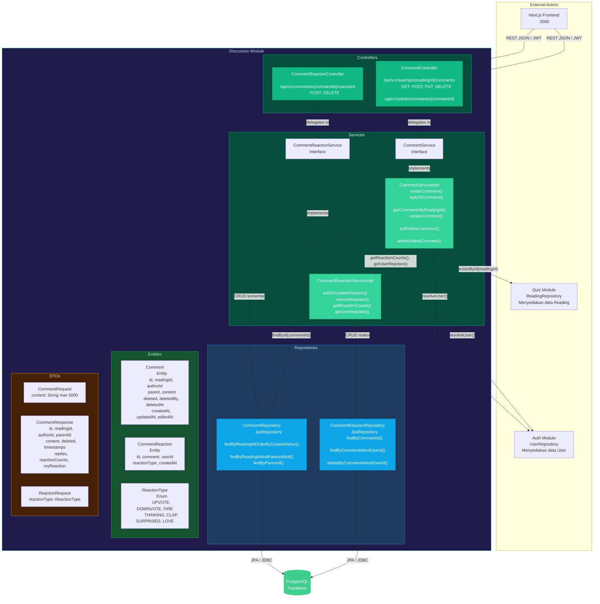
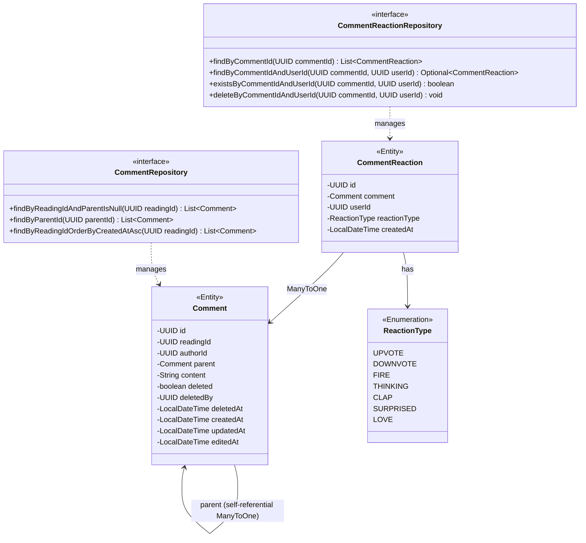
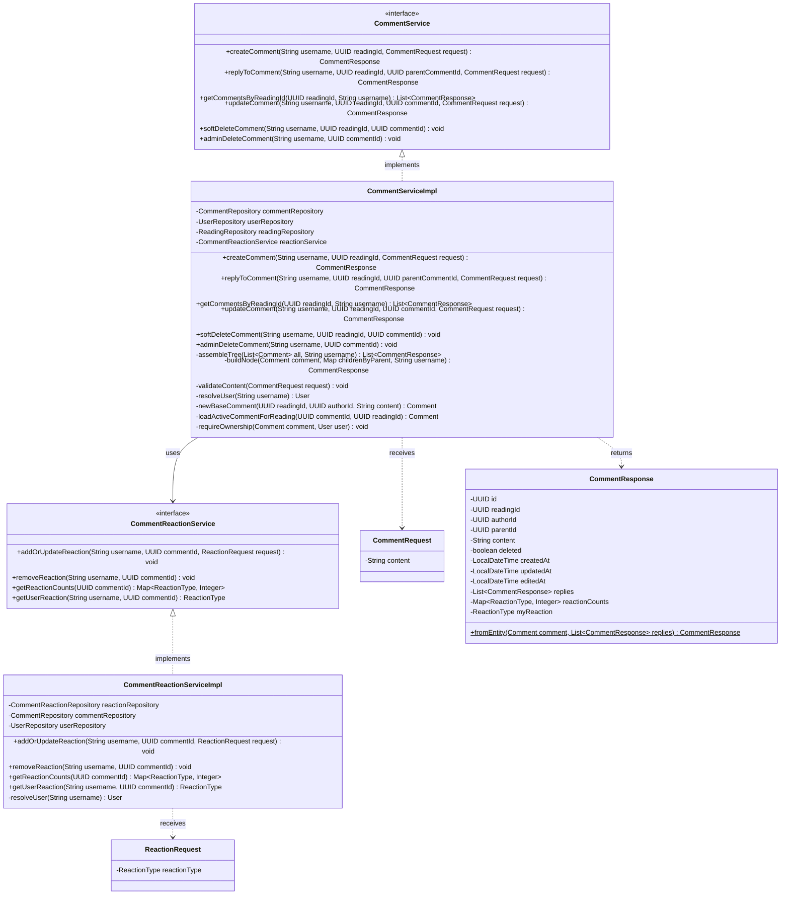
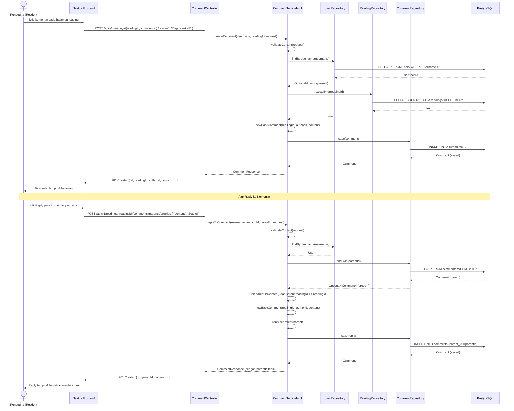
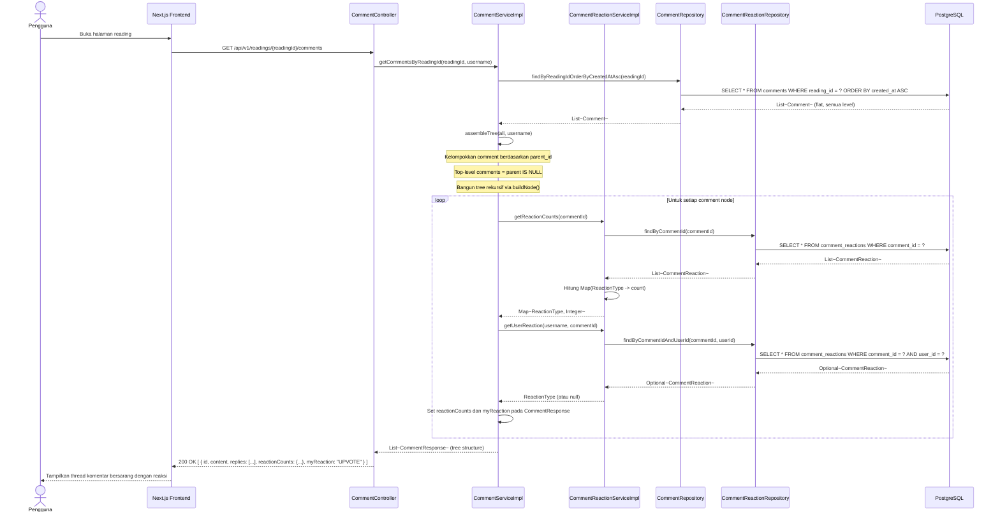
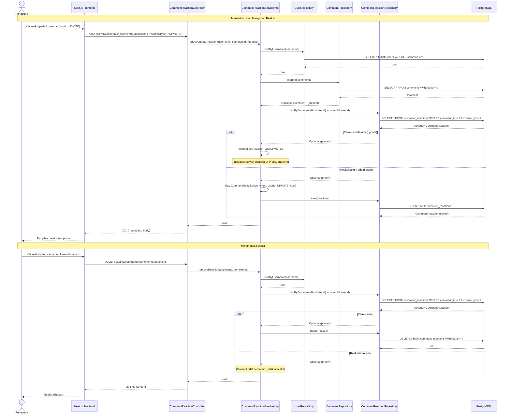
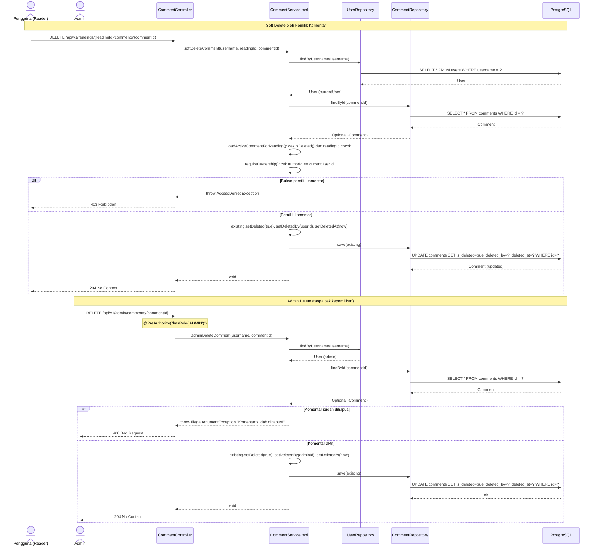

## Component Diagram - Discussion Module

Menunjukkan komponen internal Discussion Module dan cara interaksinya dengan modul lain.

### Ringkasan Interaksi Komponen

| From | To | Interaksi | Keterangan |
|---|---|---|---|
| Frontend | CommentController | `GET/POST/PUT/DELETE /api/v1/readings/{readingId}/comments/**` | REST/JSON + JWT |
| Frontend | CommentReactionController | `POST/DELETE /api/v1/comments/{commentId}/reactions` | REST/JSON + JWT |
| CommentController | CommentServiceImpl | Delegasi semua operasi komentar | Method call |
| CommentReactionController | CommentReactionServiceImpl | Delegasi semua operasi reaksi | Method call |
| CommentServiceImpl | UserRepository | `resolveUser(username)` - ambil data author | Direct import (coupling) |
| CommentServiceImpl | ReadingRepository | `existsById(readingId)` - validasi reading | Direct import (coupling) |
| CommentServiceImpl | CommentReactionServiceImpl | `getReactionCounts()`, `getUserReaction()` saat build tree | Method call |
| CommentReactionServiceImpl | UserRepository | `resolveUser(username)` | Direct import (coupling) |
| CommentReactionServiceImpl | CommentRepository | `findById(commentId)` - validasi komentar ada | Method call |

---

## Class Diagram - Entities

---

## Class Diagram - Service Layer

---

## Sequence Diagram - Create Comment dan Reply Flow

---

## Sequence Diagram - Get Comments dengan Tree Assembly dan Reactions

---

## Sequence Diagram - Reaction Flow (Add, Update, Remove)

---

## Sequence Diagram - Soft Delete dan Admin Delete Flow

