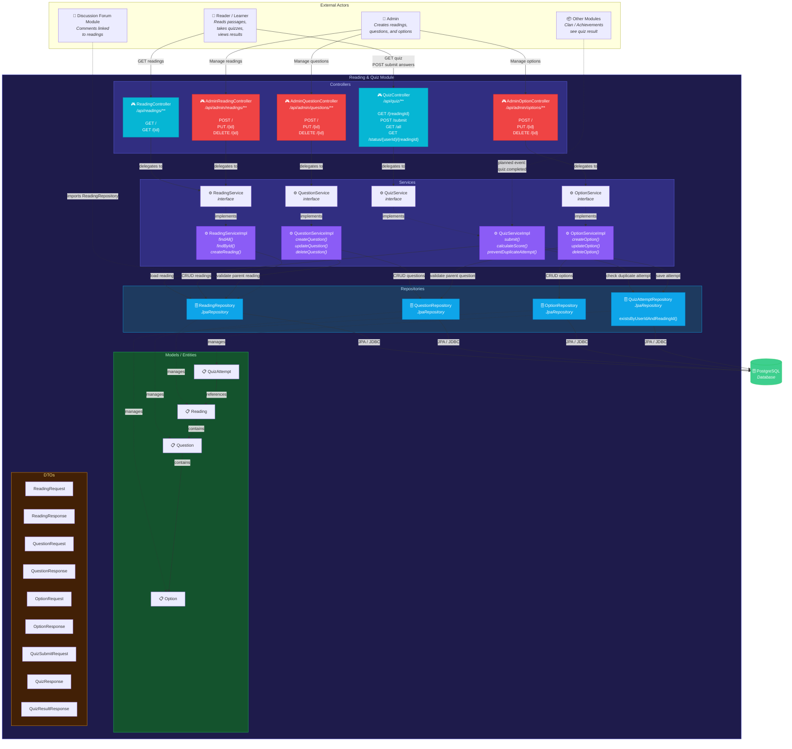
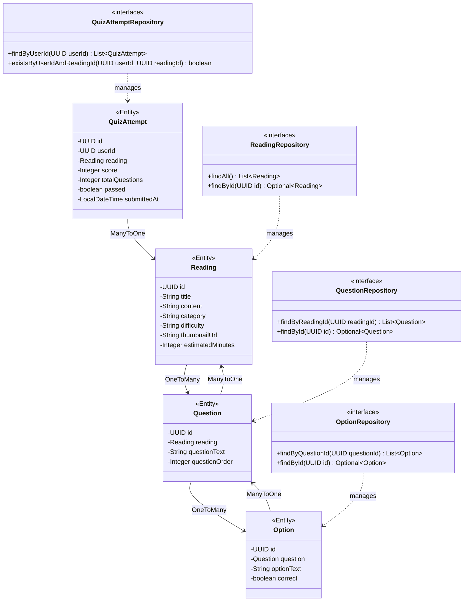
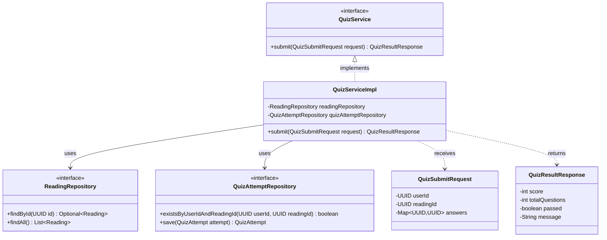
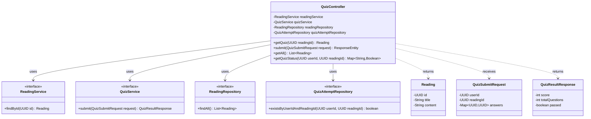
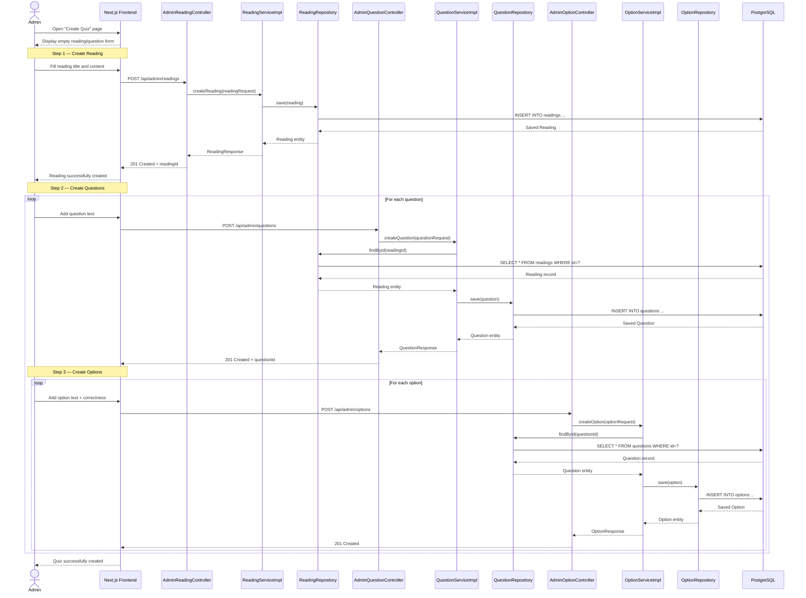
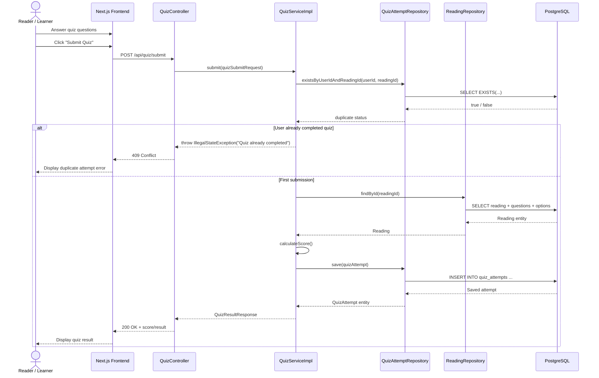

# Quiz & Reading Module — Individual Deliverable (feat/quiz)

## Component Diagram

### Ringkasan Interaksi Komponen
| From                      | To                      | Interaksi                                            | Protokol            |
| ------------------------- | ----------------------- | ---------------------------------------------------- | ------------------- |
| Reader Frontend           | QuizController          | `GET /api/quiz/{readingId}`, `POST /api/quiz/submit` | REST/JSON           |
| Reader Frontend           | ReadingController       | `GET /api/readings/**`                               | REST/JSON           |
| Admin Frontend            | AdminReadingController  | CRUD readings                                        | REST/JSON           |
| Admin Frontend            | AdminQuestionController | CRUD questions                                       | REST/JSON           |
| Admin Frontend            | AdminOptionController   | CRUD options                                         | REST/JSON           |
| QuizController            | QuizServiceImpl         | `submit()`, `getQuizStatus()`                        | Method call         |
| ReadingController         | ReadingServiceImpl      | `findAll()`, `findById()`                            | Method call         |
| AdminReadingController    | ReadingServiceImpl      | `create()`, `update()`, `delete()`                   | Method call         |
| AdminQuestionController   | QuestionServiceImpl     | `createQuestion()`, `updateQuestion()`               | Method call         |
| AdminOptionController     | OptionServiceImpl       | `createOption()`, `updateOption()`                   | Method call         |
| QuizServiceImpl           | QuizAttemptRepository   | `existsByUserIdAndReadingId()`, `save()`             | JPA                 |
| QuizServiceImpl           | ReadingRepository       | `findById()`                                         | JPA                 |
| QuestionServiceImpl       | QuestionRepository      | CRUD operations                                      | JPA                 |
| OptionServiceImpl         | OptionRepository        | CRUD operations                                      | JPA                 |
| Semua Repository          | PostgreSQL              | Persist entities                                     | JDBC / JPA          |

---

## Class Diagram - Entity

## Class Diagram - Entities

---

## Class Diagram — QuizService

---

## Class Diagram — QuizController

---

## Sequence Diagram - Admin Creates a Quiz

---

## Sequence Diagram - Quiz Submission Flow

