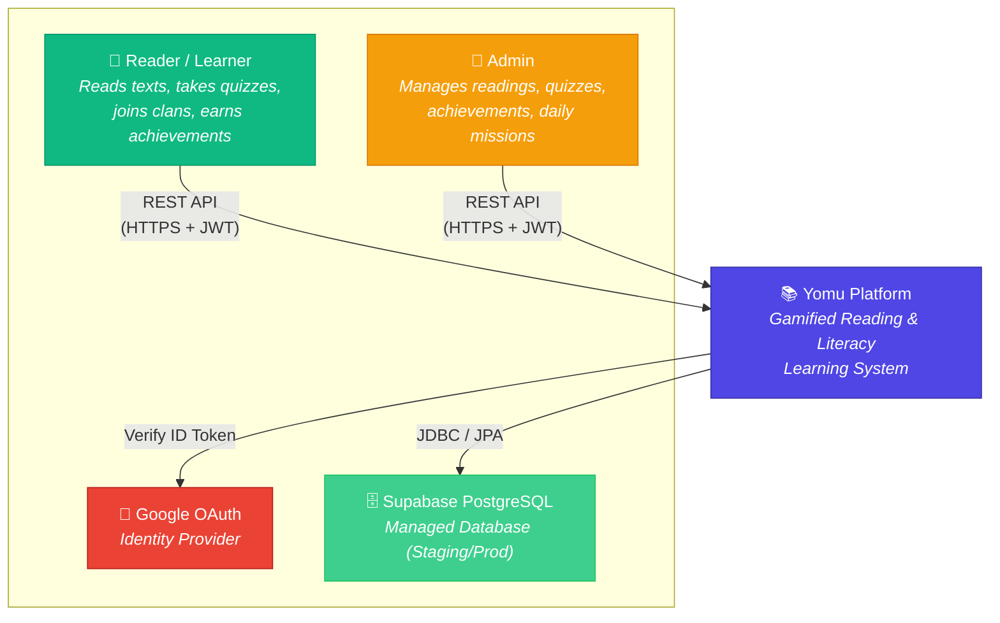
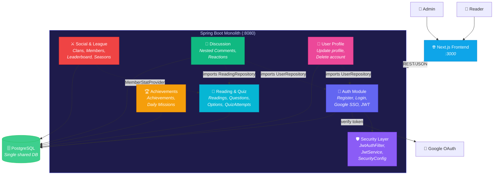
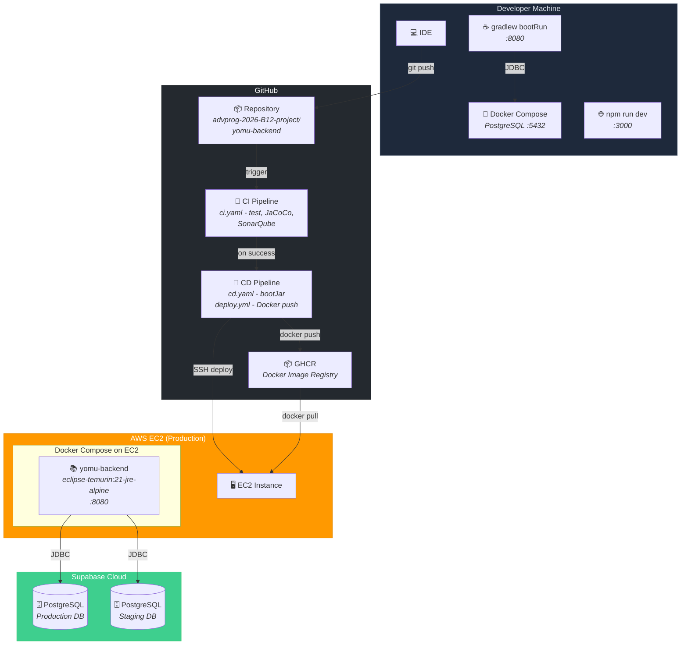
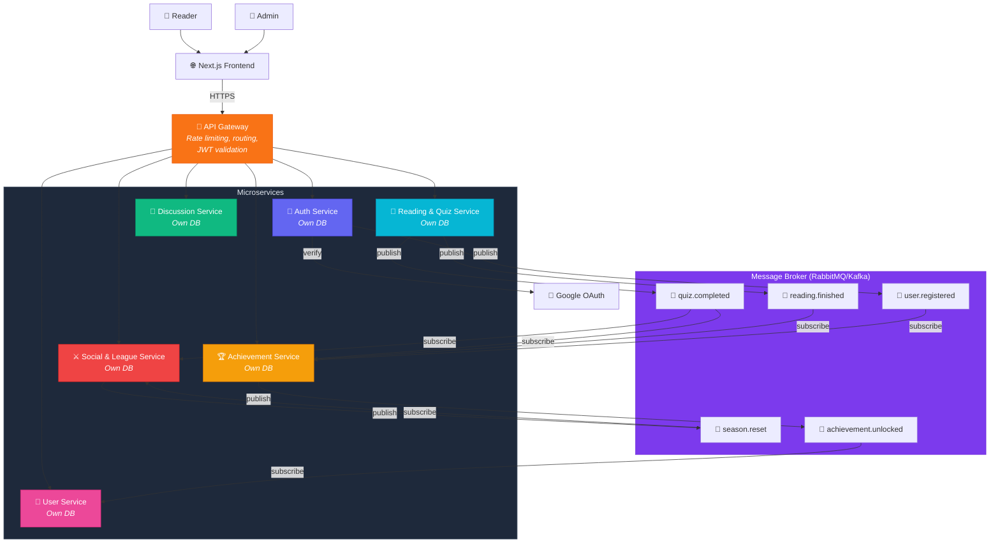
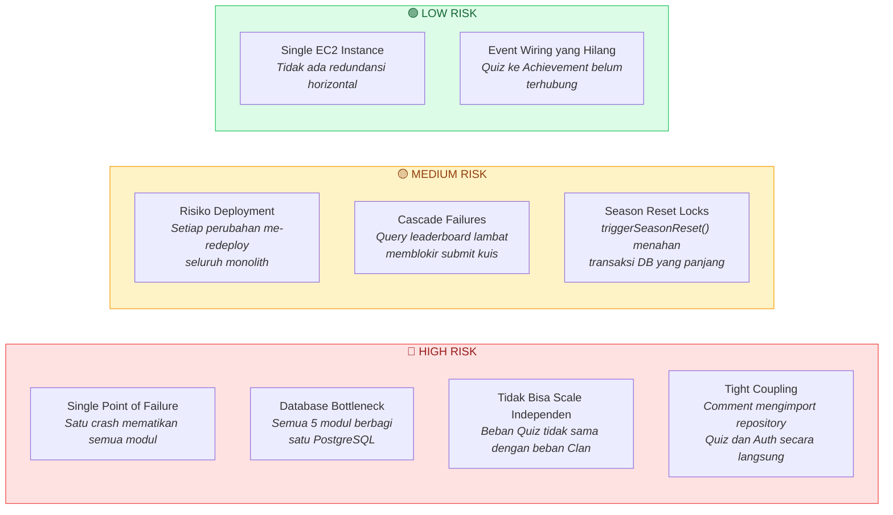

## System Context Diagram

System context menunjukkan Yomu dan aktor/sistem eksternal yang berinteraksi dengannya.

| Element | Type | Description |
|---|---|---|
| **Reader / Learner** | Person | Pengguna utama yang membaca teks, mengerjakan kuis, bergabung dengan clan, dan melihat leaderboard |
| **Admin** | Person | Mengelola konten berupa bacaan, kuis, achievements, dan daily missions |
| **Yomu Platform** | Software System | Platform membaca gamifikasi yang sedang dianalisis |
| **Google OAuth** | External System | Identity provider SSO untuk login Google |
| **Supabase PostgreSQL** | External System | PostgreSQL terkelola yang digunakan di staging/production |

---

## Container Diagram

Menunjukkan container internal dan bagaimana kelima modul hidup dalam satu unit yang dapat di-deploy.

### Ketergantungan Antar Modul (Direct Coupling)

| From | To | Jenis Coupling | Bukti |
|---|---|---|---|
| Comment → Auth | Import `UserRepository` | Akses DB langsung | CommentServiceImpl.java |
| Comment → Quiz | Import `ReadingRepository` | Akses DB langsung | CommentServiceImpl.java |
| User → Auth | Import `UserRepository` | Akses DB langsung | UserServiceImpl.java |
| Clan/League → Quiz | `MemberStatProvider` | Interface (loose) | LeagueService.java |
| Quiz → Achievements | Belum terhubung | Event yang direncanakan | Quiz completion seharusnya memicu progress achievement |

---

## Deployment Diagram

| Layer | Teknologi | Detail |
|---|---|---|
| **Runtime** | Eclipse Temurin 21 (JRE Alpine) | Multi-stage Docker build |
| **Container Orchestration** | Docker Compose | Single EC2 instance |
| **CI** | GitHub Actions | JUnit, JaCoCo (80%), SonarQube |
| **CD** | GitHub Actions + SSH | Docker image → GHCR → EC2 pull |
| **Database** | Supabase PostgreSQL | Instansi staging/prod terpisah |
| **Frontend** | Next.js (repo terpisah) | Di-deploy secara independen |

---

## Future Container Diagram - Event-Driven Architecture (EDA)

### Key Events dalam EDA

| Event | Publisher | Subscribers | Payload |
|---|---|---|---|
| `quiz.completed` | Quiz Service | Achievement Service, Clan/League Service | `{userId, readingId, score, total, timestamp}` |
| `reading.finished` | Quiz Service | Achievement Service | `{userId, readingId, timestamp}` |
| `user.registered` | Auth Service | Achievement Service | `{userId, username, timestamp}` |
| `season.reset` | Clan Service (scheduled) | Clan Service, League Service | `{seasonId, timestamp}` |
| `achievement.unlocked` | Achievement Service | User Service (notifications) | `{userId, achievementId, name, timestamp}` |

### Database per Service

| Service | Database | Tabel Utama |
|---|---|---|
| Auth Service | `auth_db` | `users`, `roles` |
| Quiz Service | `quiz_db` | `readings`, `questions`, `options`, `quiz_attempts` |
| Achievement Service | `achievement_db` | `achievements`, `user_achievements`, `daily_missions`, `user_daily_missions` |
| Clan Service | `clan_db` | `clans`, `clan_members` |
| Comment Service | `comment_db` | `comments`, `comment_reactions` |
| User Service | `user_db` | `user_profiles` |

---

## Risk Storming - Monolith di Bawah Skala Besar

Risk Storming mengevaluasi apa yang bisa salah ketika Yomu mendapatkan popularitas besar (100.000+ pengguna concurrent).

### Risk Map

### Analisis Risiko Detail

| # | Risiko | Severity | Dampak | Area |
|---|---|---|---|---|
| **R1** | **Single Point of Failure** | Tinggi | Jika JVM crash atau OOM, semua fitur mati sekaligus | Availability |
| **R2** | **Shared Database Bottleneck** | Tinggi | Semua modul berebut connection pool PostgreSQL yang sama. Query N+1 leaderboard akan menghabiskan koneksi untuk submit kuis | Performance |
| **R3** | **Tidak Bisa Scale Independen** | Tinggi | Saat peak hour, traffic kuis bisa 10x traffic clan, tapi tidak bisa scale pemrosesan kuis saja | Scalability |
| **R4** | **Tight Cross-Module Coupling** | Tinggi | `CommentServiceImpl` langsung mengimport `UserRepository` dan `ReadingRepository` dari modul lain. Perubahan model Auth/Quiz merusak Comments | Maintainability |
| **R5** | **Deployment Berisiko** | Sedang | Bug fix di Comments membutuhkan redeploy seluruh aplikasi, berisiko regresi Auth/Quiz | Reliability |
| **R6** | **Cascade Failures** | Sedang | `LeagueService.getLeaderboardByDivision()` yang lambat menghabiskan thread pool dan memblokir request yang tidak terkait | Performance |
| **R7** | **Transaksi Panjang saat Season Reset** | Sedang | `triggerSeasonReset()` memproses semua 4 divisi dalam satu `@Transactional`, mengunci baris di seluruh clan | Data Integrity |
| **R8** | **Single EC2, Tanpa Redundansi** | Rendah | Saat ini masih bisa diterima untuk proyek mahasiswa, tapi fatal pada skala besar | Availability |
| **R9** | **Quiz→Achievement Belum Terhubung** | Rendah | `processEvent()` sudah ada tapi quiz completion belum memanggilnya | Correctness |

---

## Bagaimana EDA Menyelesaikan Risiko yang Teridentifikasi

| Risiko | Solusi EDA |
|---|---|
| **R1 - Single Point of Failure** | Setiap service berjalan independen. Jika Achievement Service crash, Quiz dan Auth tetap berjalan. Event yang belum diproses disimpan di broker dan di-replay saat recovery. |
| **R2 - Database Bottleneck** | Database per service menghilangkan contention. Query leaderboard pada `clan_db` tidak bisa mengganggu submit kuis pada `quiz_db`. |
| **R3 - Tidak Bisa Scale Independen** | Quiz Service bisa scale ke 10 replika saat peak hour sementara Clan Service tetap di 2 replika. |
| **R4 - Tight Coupling** | Modul hanya berkomunikasi lewat events. Comment Service subscribe ke `user.registered` untuk menyimpan cache lokal, bukan mengimport `UserRepository` secara langsung. |
| **R5 - Deployment Berisiko** | Setiap service di-deploy independen. Bug fix di Comments hanya men-deploy Comment Service saja. |
| **R6 - Cascade Failures** | Pemrosesan event secara asynchronous via broker berarti kalkulasi leaderboard yang lambat tidak bisa memblokir submit kuis. |
| **R7 - Transaksi Panjang Season Reset** | Season reset mempublish event `season.reset`. Pemrosesan dipecah menjadi transaksi kecil independen per clan. |
| **R8 - Single EC2** | Microservices secara natural di-deploy di banyak node dengan container orchestration. |
| **R9 - Quiz→Achievement Belum Terhubung** | EDA membuat ini mudah: Quiz Service publish `quiz.completed`; Achievement Service subscribe dan memanggil `processEvent()`. |

### Ringkasan: Monolith vs EDA

```mermaid
graph LR
    subgraph mono ["Saat Ini: Monolith"]
        direction TB
        M1["Satu proses = satu failure domain"]
        M2["Shared DB = contention"]
        M3["Scale semua atau tidak sama sekali"]
        M4["Direct imports = tight coupling"]
        M5["Full redeploy setiap perubahan"]
    end

    subgraph eda ["Masa Depan: EDA"]
        direction TB
        E1["Failure domain terisolasi"]
        E2["DB per service = tidak ada contention"]
        E3["Scale setiap service secara independen"]
        E4["Events = loose coupling"]
        E5["Deployment independen"]
    end

    mono -->|"migrasi"| eda

    style mono fill:#FEE2E2,color:#991B1B,stroke:#EF4444
    style eda fill:#DCFCE7,color:#166534,stroke:#22C55E
```

Strategi migrasi yang direkomendasikan adalah Strangler Fig Pattern. Ekstrak satu modul sekaligus, mulai dari Achievements karena sudah memiliki `processEvent()` yang didesain untuk konsumsi event, lalu perkenalkan broker di samping monolith dan secara bertahap alihkan traffic ke service baru.

## Individual Diagram

| [Ahmad Faiq Fawwaz Abdussalam](Auth.md) | [Sabina Maritza Moenzil](Quiz.md) | [Julius Albert Wirayuda](Achievements.md) | [Muhammad Hariz Albaari](Comments.md) | [Fadhil Daffa Putra Irawan](Clans.md) |
| -- |-----------------------------------| -- | -- | -- |
