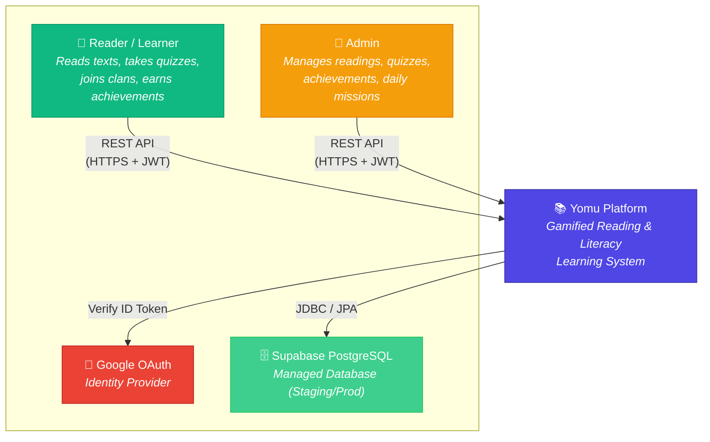
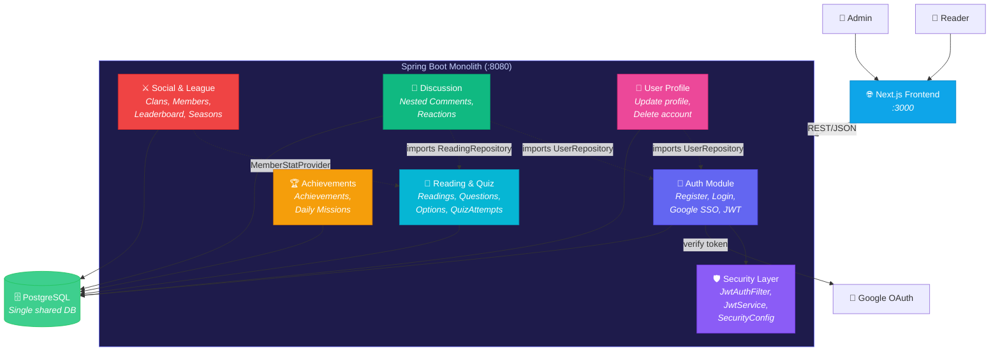
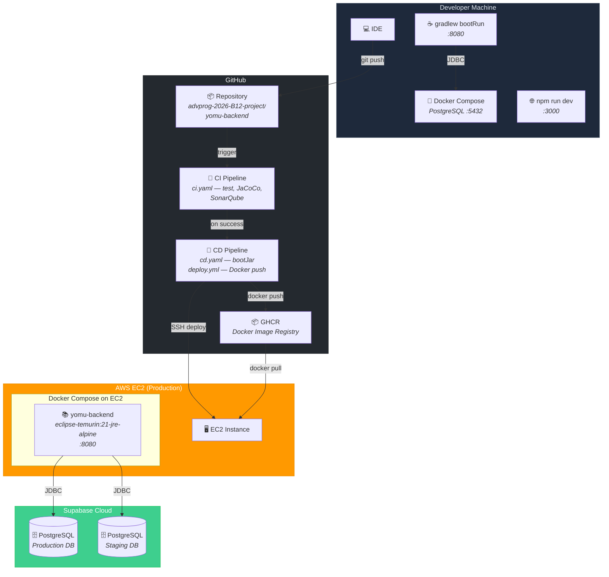
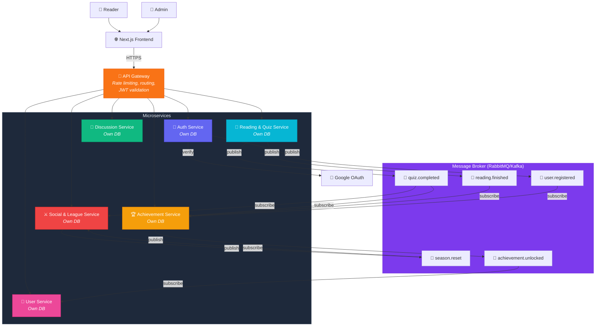

## System Context Diagram

System context menunjukkan Yomu dan aktor/sistem eksternal yang berinteraksi dengannya.

| Element | Type | Description |
|---|---|---|
| **Reader / Learner** | Person | Pengguna utama yang membaca teks, mengerjakan kuis, bergabung dengan clan, dan melihat leaderboard |
| **Admin** | Person | Mengelola konten berupa bacaan, kuis, achievements, dan daily missions |
| **Yomu Platform** | Software System | Platform membaca gamifikasi yang sedang dianalisis |
| **Google OAuth** | External System | Identity provider SSO untuk login Google |
| **Supabase PostgreSQL** | External System | PostgreSQL terkelola yang digunakan di staging/production |

---

## Container Diagram

Menunjukkan container internal dan bagaimana kelima modul hidup dalam satu unit yang dapat di-deploy.

### Ketergantungan Antar Modul (Direct Coupling)

| From | To | Jenis Coupling | Bukti |
|---|---|---|---|
| Comment → Auth | Import `UserRepository` | Akses DB langsung | CommentServiceImpl.java |
| Comment → Quiz | Import `ReadingRepository` | Akses DB langsung | CommentServiceImpl.java |
| User → Auth | Import `UserRepository` | Akses DB langsung | UserServiceImpl.java |
| Clan/League → Quiz | `MemberStatProvider` | Interface (loose) | LeagueService.java |
| Quiz → Achievements | Belum terhubung | Event yang direncanakan | Quiz completion seharusnya memicu progress achievement |

---

## Deployment Diagram

| Layer | Teknologi | Detail |
|---|---|---|
| **Runtime** | Eclipse Temurin 21 (JRE Alpine) | Multi-stage Docker build |
| **Container Orchestration** | Docker Compose | Single EC2 instance |
| **CI** | GitHub Actions | JUnit, JaCoCo (80%), SonarQube |
| **CD** | GitHub Actions + SSH | Docker image → GHCR → EC2 pull |
| **Database** | Supabase PostgreSQL | Instansi staging/prod terpisah |
| **Frontend** | Next.js (repo terpisah) | Di-deploy secara independen |

---

## Future Container Diagram — Event-Driven Architecture (EDA)

### Key Events dalam EDA

| Event | Publisher | Subscribers | Payload |
|---|---|---|---|
| `quiz.completed` | Quiz Service | Achievement Service, Clan/League Service | `{userId, readingId, score, total, timestamp}` |
| `reading.finished` | Quiz Service | Achievement Service | `{userId, readingId, timestamp}` |
| `user.registered` | Auth Service | Achievement Service | `{userId, username, timestamp}` |
| `season.reset` | Clan Service (scheduled) | Clan Service, League Service | `{seasonId, timestamp}` |
| `achievement.unlocked` | Achievement Service | User Service (notifications) | `{userId, achievementId, name, timestamp}` |

### Database per Service

| Service | Database | Tabel Utama |
|---|---|---|
| Auth Service | `auth_db` | `users`, `roles` |
| Quiz Service | `quiz_db` | `readings`, `questions`, `options`, `quiz_attempts` |
| Achievement Service | `achievement_db` | `achievements`, `user_achievements`, `daily_missions`, `user_daily_missions` |
| Clan Service | `clan_db` | `clans`, `clan_members` |
| Comment Service | `comment_db` | `comments`, `comment_reactions` |
| User Service | `user_db` | `user_profiles` |
